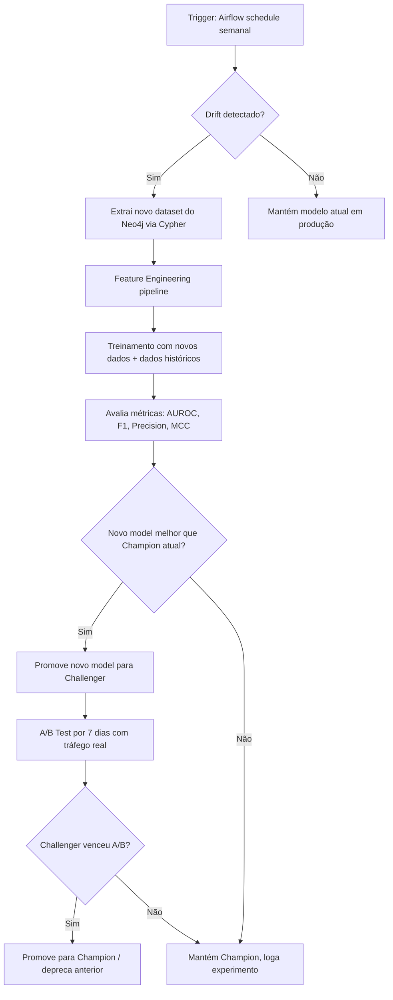

# PLAN: ML/MLOps Intelligence Platform — Evasão Escolar & Análise Pedagógica

> **Slug:** `ml-neo4j-school`
> **Tipo do Projeto:** BACKEND / DATA SCIENCE / MLOps  
> **Status:** PLANEJAMENTO  
> **Data:** 2026-02-21

---

## 🎯 Visão Geral

Este plano define a arquitetura e o roadmap completo para construir um sistema de inteligência preditiva e analítica sobre dados educacionais, com três pilares fundamentais:

1. **Modelos ML Tradicionais** — Predição de evasão escolar, queda de rendimento, risco por perfil socioeconômico e geográfico, com explicabilidade estatística via SHAP/Feature Importance.
2. **Neo4j como Banco Vetorial (RAG)** — Embeddings de alunos, escolas e métricas para responder perguntas como *"Analise o aluno X considerando o histórico da escola Y e benchmarks regionais do IBGE"*.
3. **MLOps Pipeline** — Retreinamento automático com novos dados, comparação de versões (A/B de modelos), model registry, drift detection e seleção de campeão/challenger.

A base de dados já está normalizada no Neo4j via os pipelines `neo4j_full_migration` e `neo4j_incremental_migration`. Toda a inteligência vai **nascer a partir do grafo** existente.

---

## ❓ 10+ Perguntas Estratégicas do Gestor (Cases de Uso)

Estes são os casos de uso que os modelos e o RAG devem conseguir responder:

| # | Pergunta | Tipo de Análise |
|---|----------|-----------------|
| 1 | **"Quais alunos têm alta probabilidade de evadir nos próximos 30 dias?"** | Classificação (ML) |
| 2 | **"Qual é a correlação entre doenças crônicas (saúde) e desempenho acadêmico por região?"** | Correlação + Geo ML |
| 3 | **"Escolas em regiões com baixo IDH no IBGE têm maior taxa de evasão mesmo com notas similares?"** | Análise Geoespacial + Regressão |
| 4 | **"Quais disciplinas têm maior impacto negativo e positivo na nota final?"** | Importância de Features + SHAP |
| 5 | **"O aluno João da Escola X está com padrão de risco. O que aconteceu com alunos com perfil semelhante em outras escolas?"** | RAG + Graph Similarity |
| 6 | **"Alunos do Bolsa Família têm maior taxa de evasão depois do 5º bimestre?"** | Segmentação + Sobrevivência |
| 7 | **"Mostre as escolas com melhor recuperação de alunos em risco em comparação com a média regional do IBGE."** | Benchmarking + Graph Ranking |
| 8 | **"Qual é o perfil econômico e geográfico típico de alunos recorrentemente reprovados?"** | Clustering + Profiling |
| 9 | **"Em quais dias/meses a frequência cai mais? Isso está correlacionado com calendário climático regional?"** | Série Temporal + Correlação External |
| 10 | **"Me dê um relatório completo do aluno Y: notas, frequência, saúde, escola, histórico de turmas, e sugestões de intervenção baseadas em casos similares de sucesso."** | RAG com contexto full-graph |
| 11 | **"Qual professor (teacher_id) está estatisticamente correlacionado com melhor desempenho de notas por disciplina?"** | Análise causal + Ranking |
| 12 | **"Me classifique todas as escolas em quartis de risco de evasão para o próximo semestre."** | Multi-label Classification + Dashboard |

---

## 🏗️ Arquitetura do Sistema

```
                         ┌─────────────────────────────┐
                         │       SQL Server DW          │
                         │  (dbo_tia / dbo_tia_dev)    │
                         └─────────────┬───────────────┘
                                       │ Airflow DAGs (Full + Incremental)
                                       ▼
                         ┌─────────────────────────────┐
                         │          NEO4J               │
                         │  ┌──────────────────────┐   │
                         │  │  Graph Store (Nodes + │   │
                         │  │  Edges + Properties)  │   │  ◄── Core já existente
                         │  └──────────────────────┘   │
                         │  ┌──────────────────────┐   │
                         │  │  Vector Index (HNSW)  │   │  ◄── A ser criado
                         │  │  (Embeddings RAG/ML)  │   │
                         │  └──────────────────────┘   │
                         └─────────┬───────────────────┘
                                   │
              ┌────────────────────┼─────────────────────┐
              ▼                    ▼                       ▼
  ┌──────────────────┐  ┌──────────────────┐   ┌──────────────────────┐
  │  ML Training     │  │  RAG Layer       │   │  MLOps / Experiment  │
  │  Pipeline        │  │  (LangChain +    │   │  Tracking (MLflow)   │
  │  (scikit-learn + │  │   Cypher + IBGE) │   │  + Auto-Retrain      │
  │   XGBoost + SHAP │  └──────────────────┘   └──────────────────────┘
  └──────────────────┘
              │
              ▼
  ┌──────────────────────────────────┐
  │  API (FastAPI) + Airflow DAG     │
  │  para servir predições e reports │
  └──────────────────────────────────┘
```

---

## 📦 Módulo 0 — Preparação do Neo4j (Embeddings & Vector Index)

### 0.1 O que indexar vetorialmente (para RAG)

Para responder perguntas como *"alunos com perfil parecido ao João"*, precisa-se converter os nós do grafo em vetores numéricos de alta dimensão.

| Nó Neo4j | Estratégia de Embedding | Dimensões | Obs. |
|----------|------------------------|-----------|------|
| `Student` | Demográficas (gênero, etnia, CEP, deficiência, bolsa família) + médias de notas (Fundamental) + presença (Elementar e Fundamental) | 256 | Fonte universal |
| `School` | Localização (lat/lon), situação, região IBGE, indicadores de evasão agregados | 256 | Fonte universal |
| `SchoolGeograph` | CEP/cidade/UF + dados IBGE (IDH, densidade, saneamento) | 128 | Fonte universal |
| `StudentDiscipline` | Médias, recuperações e situação final por disciplina | 128 | **Apenas Fundamental** — Elementar não tem disciplinas individuais |
| `Class` | Disciplina associada à turma, escola, dias letivos, ano letivo | 128 | **Apenas Fundamental** — Elementar as aulas são unificadas e `discipline_id = 'elementary_school'` |
| `StudentClass` | Total de faltas por dia e por disciplina por aluno por turma | 128 | **Ambos os níveis** — chave para frequência |
| `Avaliation` | Situação da avaliação + conexão com Student e Discipline | 64 | **Apenas Fundamental** |

### 0.2 Cypher para criação dos Vector Indexes no Neo4j 5.11+

```cypher
-- Index vetorial para Student Profiles
CREATE VECTOR INDEX student_embedding IF NOT EXISTS
FOR (s:Student)
ON s.embedding
OPTIONS {indexConfig: {`vector.dimensions`: 512, `vector.similarity_function`: 'cosine'}};

-- Index vetorial para School Profiles
CREATE VECTOR INDEX school_embedding IF NOT EXISTS
FOR (s:School)
ON s.embedding
OPTIONS {indexConfig: {`vector.dimensions`: 512, `vector.similarity_function`: 'cosine'}};

-- Index vetorial para Geograph + IBGE
CREATE VECTOR INDEX geograph_embedding IF NOT EXISTS
FOR (g:SchoolGeograph)
ON g.embedding
OPTIONS {indexConfig: {`vector.dimensions`: 256, `vector.similarity_function`: 'cosine'}};
```

### 0.3 O que indexar vetorialmente (para treinamento de ML)

Para os **modelos clássicos de ML** (scikit-learn, XGBoost) não precisamos de embeddings vetoriais, mas precisamos de **feature engineering a partir do grafo**:

```
📊 Feature Set para ML (extraído via Cypher → Pandas DataFrame):

⚠️  DISTINÇÃO CRÍTICA: Ensino Elementar vs Ensino Fundamental

──────────────────────────────────────────────────────────────
 ENSINO ELEMENTAR (anos iniciais, séries unificadas)
──────────────────────────────────────────────────────────────
  O aluno NÃO tem ligação direta com disciplinas individuais.
  A relação Class→Discipline usa discipline_id = 'elementary_school'.
  Portanto, NÃO existem registros em F_AVALIATION ou D_STUDENT_DISCIPLINE
  para alunos exclusivamente elementares.

  Features disponíveis por aluno:
  - Demográficas: gênero, etnia, deficiência, zona residencial, bolsa_familia
  - Saúde (Health): n_doenças, tipo_doença_mais_prevalente
  - Frequência (StudentClass): total_faltas_por_dia, scheduled_student_class_days
  - Contexto da Turma (Class→Classroom→School): n_turmas, ano_letivo, scheduled_class_days,
    disciplina unificada, dias por mês agendados
  - Contexto escola: situação, geolocalização, IDH_região (IBGE)
  - Target 'evasão': 0/1 (derivado de enrollment_status)

──────────────────────────────────────────────────────────────
 ENSINO FUNDAMENTAL (anos finais, disciplinas individuais)
──────────────────────────────────────────────────────────────
  O aluno TEM ligação com disciplinas e avaliações individuais.
  Isso expande consideravelmente o feature set.

  Features adicionais (além das Elementar acima):
  - Notas por disciplina (D_STUDENT_DISCIPLINE): grade_1, grade_2, grade_3, grade_4,
    rec_bim_1..4, rec_sem_1..4, final_mean, nota_final_media
  - Recuperações acumuladas: n_disciplinas_em_recuperação
  - Avaliação final (F_AVALIATION): situação final por discipline
  - Faltas por disciplina (StudentClass): total_faults_per_discipline
  - Impacto do professor (Class.teacher_id) por disciplina

  Target adicional: 'risco_reprovação' (1 se final_mean < limiar)
```

---

## 🤖 Módulo 1 — Modelos ML Tradicionais

### 1.1 Modelos a Implementar

| Modelo | Caso de Uso | Nível | Biblioteca | Output |
|--------|-------------|-------|------------|--------|
| `XGBoostClassifier` | Predição de evasão (0/1) | ✅ Ambos | `xgboost` | Prob. de evasão por aluno |
| `RandomForestClassifier` | Risco multi-classe (baixo/médio/alto) | ✅ Ambos | `scikit-learn` | Score de risco |
| `GradientBoostingRegressor` | Regressão de nota final prevista | ⚠️ **Apenas Fundamental** (Elementar tem nota unificada) | `scikit-learn` | Nota prevista |
| `KMeans + DBSCAN` | Clustering de perfis de risco | ✅ Ambos | `scikit-learn` | Cluster por perfil |
| `Kaplan-Meier` | Análise de sobrevivência (tempo até evasão) | ✅ Ambos | `lifelines` | Curva de sobrevivência |
| `SHAP` | Explicabilidade de feature importance | ✅ Ambos | `shap` | Visualização de impacto |
| `CatBoostClassifier` | Baseline alternativo com cat features | ✅ Ambos | `catboost` | Comparação |

### 1.2 Pipeline de Treinamento

```
Neo4j (Cypher Query) → Pandas DataFrame → Feature Engineering
    → Train/Test Split (temporally aware) → Model Training
    → Evaluation (AUROC, F1, Precision/Recall) → MLflow Log
    → Model Registry → Champion/Challenger Comparison
```

### 1.3 Features de Correlação Geográfica (IBGE)

Dados externos do IBGE serão ingestados como propriedades nos nós `SchoolGeograph`:

- **IDH Municipal** (Índice Desenvolvimento Humano)
- **Taxa de Analfabetismo** por município
- **Densidade Escolar** (número de escolas por hab)
- **PIB Per Capita** municipal
- **Acesso a Saneamento Básico**

Esses dados serão correlacionados com métricas de evasão via análise de Correlação de Spearman e Regressão Logística.

---

## 🔍 Módulo 2 — RAG (Retrieval Augmented Generation)

### 2.1 Arquitetura RAG

```
Pergunta do Gestor (natural language)
        │
        ▼
[LLM — ex: GPT-4o / Gemini Flash]
Extrai entidades: aluno_id, escola, região, período
        │
        ▼
[LangChain Retriever] ←──────────────────────────────────┐
  1. Cypher Query: busca contexto estruturado no grafo    │
  2. Vector Search: busca alunos similares por embedding  │
  3. IBGE External Retriever: dados regionais             │
        │                                                 │
        ▼                                                 │
[Context Builder] → Monta prompt com:                    │
  - Dados do aluno (nó Student + conexões)               │
  - Top 5 alunos similares (vector search)               │
  - Métricas da Escola                                    │
  - Benchmark IBGE da região                             │
        │                                                 │
        ▼                                                 │
[LLM] → Gera resposta estruturada: análise + sugestões   │
        │                                                 │
        └─────────────────────────────────────────────────┘
              [MLflow] logs a rag call + latência
```

### 2.2 Exemplo de Query RAG Cypher

```cypher
// Contexto completo de um aluno para o RAG
MATCH (s:Student {id: $student_id})
OPTIONAL MATCH (s)-[:ENROLLED_IN]->(e:Enrollment)
OPTIONAL MATCH (e)-[:ENROLLED_AT_SCHOOL]->(school:School)
OPTIONAL MATCH (school)-[:HAS_GEOGRAPHY]->(geo:SchoolGeograph)
OPTIONAL MATCH (s)-[:HAS_HEALTH]->(h:Health)
OPTIONAL MATCH (s)-[:HAS_DISCIPLINE]->(sd:StudentDiscipline)
OPTIONAL MATCH (s)-[:ATTENDANCE_OF]->(sc:StudentClass)
RETURN s, school, geo, h, collect(sd) as disciplines, collect(sc) as classes
LIMIT 1
```

```cypher
// Alunos similares via Vector Search (para comparação de casos de sucesso)
CALL db.index.vector.queryNodes('student_embedding', 5, $query_embedding)
YIELD node AS similar_student, score
WHERE similar_student.id <> $student_id
RETURN similar_student.id, similar_student.name, score
ORDER BY score DESC
```

---

## ⚙️ Módulo 3 — MLOps Pipeline

### 3.1 Componentes MLOps

| Componente | Ferramenta | Propósito |
|-----------|------------|-----------|
| **Experiment Tracking** | `MLflow` | Registrar métricas, parâmetros, artefatos de cada versão |
| **Model Registry** | `MLflow Model Registry` | Versionar modelos: Staging → Production |
| **Auto-Retrain DAG** | `Airflow DAG` | Trigger semanal/mensal para re-treinamento |
| **Model Drift Detection** | `Evidently AI` | Detectar data drift nos inputs e concept drift nas predições |
| **Champion/Challenger** | MLflow Comparison + Python | Comparar modelo atual vs. novo candidato |
| **Serving** | `FastAPI` | Endpoints REST para predições em batch e on-demand |
| **Feature Store** | `Pandas DataFrames` (inicial) → `Feast` (futuro) | Centralizar features calculadas a partir do Neo4j |

### 3.2 Fluxo de Re-treinamento Automático



### 3.3 DAG Airflow: dag__ml_retrain.py

```
Tasks:
  ├── extract_features_from_neo4j   → Query Cypher → Parquet salvo em S3/local
  ├── run_feature_validation         → Great Expectations validation
  ├── train_model                    → scikit-learn pipeline + MLflow run
  ├── evaluate_model                 → métricas + SHAP plots
  ├── compare_with_champion          → MLflow API comparison
  ├── promote_to_challenger          → if better: set Staging tag
  └── run_ab_test_report             → report semanal em markdown
```

### 3.4 MLflow Estrutura de Experimentos

```
mlflow/
├── Experiments/
│   ├── school-dropout-prediction/
│   │   ├── run_2026-02-21/
│   │   │   ├── params: {n_estimators: 500, max_depth: 8, ...}
│   │   │   ├── metrics: {auroc: 0.92, f1: 0.87, ...}
│   │   │   ├── artifacts: model.pkl, shap_plot.png, feature_importance.csv
│   │   │   └── tags: {champion: true, version: v3}
│   ├── grade-regression/
│   └── student-clustering/
```

---

## 📁 Estrutura de Arquivos Proposta

```
airflow_migration/
├── dags/
│   ├── dag__neo4j_full_migration.py        ✅ Existente
│   ├── dag__neo4j_incremental_migration.py ✅ Existente
│   ├── dag__ml_feature_engineering.py      🆕 Extrai features do Neo4j → Parquet
│   ├── dag__ml_retrain.py                  🆕 Orquestra retreinamento + MLflow
│   ├── dag__ml_drift_detection.py          🆕 Evidently AI drift monitoring
│   └── dag__rag_embedding_refresh.py       🆕 Gera embeddings e atualiza Neo4j Vector Index
│
├── src/
│   ├── ml/
│   │   ├── features/
│   │   │   ├── student_features.py         🆕 Query Cypher → DataFrame de features
│   │   │   ├── school_features.py          🆕 Features por escola
│   │   │   └── ibge_enricher.py            🆕 Integração dados IBGE
│   │   ├── models/
│   │   │   ├── dropout_classifier.py       🆕 XGBoost/RF para evasão
│   │   │   ├── grade_regressor.py          🆕 GBM para previsão de notas
│   │   │   └── risk_clusterer.py           🆕 KMeans/DBSCAN clustering
│   │   ├── evaluation/
│   │   │   ├── metrics.py                  🆕 AUROC, F1, MCC, Calibration
│   │   │   └── explainability.py           🆕 SHAP global + local
│   │   ├── mlops/
│   │   │   ├── mlflow_client.py            🆕 Wrapper MLflow logging
│   │   │   ├── drift_detector.py           🆕 Evidently AI integration
│   │   │   └── champion_challenger.py      🆕 Comparação + promoção automática
│   │   └── training/
│   │       └── train_pipeline.py           🆕 Pipeline scikit-learn completo
│   │
│   ├── rag/
│   │   ├── retriever.py                    🆕 Cypher + Vector queries no Neo4j
│   │   ├── context_builder.py              🆕 Monta prompt com dados do grafo
│   │   ├── llm_client.py                   🆕 Integração OpenAI / Gemini
│   │   └── rag_pipeline.py                 🆕 Orquestra RAG end-to-end
│   │
│   ├── embeddings/
│   │   ├── student_embedder.py             🆕 Gera embeddings de alunos
│   │   ├── school_embedder.py              🆕 Gera embeddings de escolas
│   │   └── neo4j_vector_writer.py          🆕 Escreve embeddings de volta no Neo4j
│   │
│   └── api/
│       ├── main.py                         🆕 FastAPI app
│       ├── routes/
│       │   ├── predictions.py              🆕 /predict/dropout, /predict/grade
│       │   ├── rag.py                      🆕 /ask/student, /ask/school
│       │   └── reports.py                  🆕 /report/school/{id}
│       └── schemas.py                      🆕 Pydantic models
│
├── notebooks/                              🆕 Exploração e validação
│   ├── 01_feature_exploration.ipynb
│   ├── 02_model_baseline.ipynb
│   ├── 03_shap_analysis.ipynb
│   └── 04_ibge_correlation.ipynb
│
├── tests/
│   ├── ml/
│   │   ├── test_features.py
│   │   ├── test_models.py
│   │   └── test_drift.py
│   └── rag/
│       └── test_retriever.py
│
├── config/
│   ├── ml_config.yaml                      🆕 Hiperparâmetros + configurações
│   └── ibge_data/                          🆕 Dados estáticos IBGE por município
│
└── docs/
    ├── PLAN-ml-neo4j-school.md             ✅ Este arquivo
    └── neo4j_guia_basico.md                ✅ Existente
```

---

## 🧩 Tech Stack

| Camada | Tecnologia | Justificativa | Custo |
|--------|-----------|---------------|-------|
| **Graph DB / Vector DB** | Neo4j 5.11+ (GDS + Vector Index) | Já implantado + HNSW nativo | 🟢 Gratuito (local) |
| **Orquestração** | Apache Airflow | Já implantado + DAGs incremental existentes | 🟢 Gratuito (local) |
| **ML Tradicional** | scikit-learn + XGBoost + CatBoost | Interpretabilidade + velocidade + ecosystem | 🟢 Gratuito |
| **Explicabilidade** | SHAP | Padrão ouro para feature contribution | 🟢 Gratuito |
| **Sobrevivência** | lifelines (Kaplan-Meier) | Análise tempo-até-evasão | 🟢 Gratuito |
| **MLOps** | MLflow | Leve, self-hosted, compatível Airflow | 🟢 Gratuito (self-hosted) |
| **Drift Detection** | Evidently AI (open-source) | Reports de data + concept drift | 🟢 Gratuito |
| **Embeddings (Primário)** | `sentence-transformers` local (`paraphrase-multilingual-MiniLM-L12-v2`) | **Gratuito, local, suporta português**, 384 dims | 🟢 Gratuito |
| **Embeddings (Alternativo)** | `Nomic Embed Text` via Ollama | Local, open-source, 768 dims, alta qualidade | 🟢 Gratuito |
| **RAG LLM (Primário)** | Gemini 1.5 Flash (Google AI Studio) | Free tier generoso (1M tokens/dia), low-latency | 🟡 Free tier / pay-per-use baixo |
| **RAG LLM (Alternativo)** | Ollama + `llama3.2` local | Totalmente local, sem custo API | 🟢 Gratuito (requer GPU/CPU boa) |
| **RAG Orchestration** | LangChain + LangGraph | Maturidade + Neo4j integration nativa | 🟢 Gratuito |
| **Serving API** | FastAPI | Já no projeto + async | 🟢 Gratuito |
| **Data External** | IBGE API / CSVs SINASC/INEP | Dados educacionais públicos e gratuitos | 🟢 Gratuito |

> [!CAUTION]
> **OpenAI (`text-embedding-3-small`) e GPT-4o foram deliberadamente REMOVIDOS como padrão.**
> - `text-embedding-3-small`: ~$0.02 por 1M tokens. Com 100k alunos cada um com 512 tokens de features = ~$1.00/run. Parece barato, mas a cada retreinamento, refresh de embeddings e escala esse custo multiplica.
> - `GPT-4o` para RAG: ~$5/1M tokens de output. Uma query elaborada pode custar $0.05–$0.15. Com uso frequente de gestores, o custo mensal pode ser expressivo.
> - **Estratégia adotada:** Embeddings locais (`sentence-transformers`) eliminam 100% do custo de embedding. RAG usa Gemini Flash (free tier suficiente para uso inicial) ou Ollama local.
> - OpenAI fica como **escape hatch** documentado: se qualidade local for insuficiente para um caso específico, pode-se chamar pontualmente e logar o custo via MLflow.

> [!NOTE]
> O modelo `paraphrase-multilingual-MiniLM-L12-v2` do `sentence-transformers` funciona excelentemente para português e é leve o suficiente para rodar inclusive dentro do Docker sem GPU.

---

## 📋 Task Breakdown

### 🔶 Phase 0 — Neo4j Vector Setup (Foundation)

#### Task 0.1 — Criar Vector Indexes no Neo4j
- **Agent:** `database-architect`
- **Input:** Neo4j existente com nós Student, School, SchoolGeograph
- **Output:** 3 Vector Indexes criados (student_embedding, school_embedding, geograph_embedding)
- **Verify:** `SHOW INDEXES` retorna os novos vector indexes com status `ONLINE`

#### Task 0.2 — Criar Cypher para Feature Extraction (ML)
- **Agent:** `backend-specialist`
- **Input:** Estrutura atual do grafo + lista de features desejadas
- **Output:** `src/ml/features/student_features.py` com queries Cypher → Pandas
- **Verify:** `python -m pytest tests/ml/test_features.py` passa

#### Task 0.3 — IBGE Enricher
- **Agent:** `data-engineer`
- **Input:** Endpoints públicos IBGE + CEPs das `SchoolGeograph` nodes
- **Output:** `src/ml/features/ibge_enricher.py` + dados escritos como propriedades no Neo4j
- **Verify:** Nós `SchoolGeograph` têm propriedades `idh_municipal`, `taxa_analfabetismo`

---

### 🔶 Phase 1 — Embedding Pipeline (RAG Foundation)

#### Task 1.1 — Student Embedder
- **Agent:** `ai-engineer`
- **Input:** Propriedades do nó `Student` + agregações de `StudentDiscipline` + `Health`
- **Output:** `src/embeddings/student_embedder.py` + `dag__rag_embedding_refresh.py`
- **Verify:** `Student` nodes no Neo4j têm propriedade `embedding` (array float64 de 512 dimensões)

#### Task 1.2 — School Embedder
- **Agent:** `ai-engineer`
- **Input:** Propriedades de `School` + `SchoolGeograph` + IBGE features
- **Output:** `src/embeddings/school_embedder.py`
- **Verify:** `School` nodes têm `embedding` e o vector index retorna resultados em `db.index.vector.queryNodes`

---

### 🔶 Phase 2 — ML Models

#### Task 2.1 — Dropout Classifier (XGBoost)
- **Agent:** `ml-engineer`
- **Input:** Feature DataFrame do Task 0.2 + rótulo de evasão definido
- **Output:** `src/ml/models/dropout_classifier.py` + notebook `02_model_baseline.ipynb`
- **Verify:** AUROC ≥ 0.80 no test set (holdout temporal) + MLflow run logado

#### Task 2.2 — Grade Regressor
- **Agent:** `ml-engineer`
- **Input:** Features acadêmicas por disciplina + nota final como target
- **Output:** `src/ml/models/grade_regressor.py`
- **Verify:** RMSE ≤ 1.5 pontos, R² ≥ 0.60

#### Task 2.3 — Risk Clusterer
- **Agent:** `data-scientist`
- **Input:** Embedding de Student (Task 1.1) ou features numéricas
- **Output:** `src/ml/models/risk_clusterer.py` + cluster labels escritos no Neo4j (`s.risk_cluster`)
- **Verify:** Silhouette Score ≥ 0.35, clusters interpretáveis por perfil demográfico

#### Task 2.4 — SHAP Explainability
- **Agent:** `ml-engineer`
- **Input:** Modelos treinados (Tasks 2.1 e 2.2)
- **Output:** `src/ml/evaluation/explainability.py` com SHAP summary e waterfall plots
- **Verify:** Top-5 features explicam ≥ 70% da variância do modelo no global SHAP summary

---

### 🔶 Phase 3 — RAG Pipeline

#### Task 3.1 — Neo4j RAG Retriever
- **Agent:** `rag-engineer`
- **Input:** Neo4j com vector indexes + Cypher context queries
- **Output:** `src/rag/retriever.py` com duas funções: `get_student_context()` e `find_similar_students()`
- **Verify:** Consulta por aluno retorna grafo completo em < 2 segundos

#### Task 3.2 — Context Builder + LLM Prompt
- **Agent:** `ai-engineer`
- **Input:** Saída do Retriever (Task 3.1)
- **Output:** `src/rag/context_builder.py` + prompt template estruturado
- **Verify:** Prompt montado contém dados do aluno, escola, 5 similares, métricas IBGE

#### Task 3.3 — RAG End-to-End Pipeline
- **Agent:** `ai-engineer`
- **Input:** Tasks 3.1 + 3.2 + LLM API configurada
- **Output:** `src/rag/rag_pipeline.py` com função `answer_manager_question(question: str)`
- **Verify:** Pergunta "Análise completa do aluno X" retorna relatório estruturado com sugestões

---

### 🔶 Phase 4 — MLOps Pipeline

#### Task 4.1 — MLflow Setup + Wrapper
- **Agent:** `mlops-engineer`
- **Input:** MLflow instalado no Docker Compose
- **Output:** `src/ml/mlops/mlflow_client.py` + MLflow server rodando em `localhost:5001`
- **Verify:** `mlflow ui` mostra os experimentos dos modelos treinados (Phase 2)

#### Task 4.2 — Drift Detector com Evidently
- **Agent:** `mlops-engineer`
- **Input:** Dados históricos de features + novos dados do período
- **Output:** `src/ml/mlops/drift_detector.py` + `dag__ml_drift_detection.py`
- **Verify:** Report HTML gerado com data drift e concept drift por feature

#### Task 4.3 — Auto-Retrain DAG
- **Agent:** `mlops-engineer`
- **Input:** Tasks 4.1 + 4.2 + modelos ML (Phase 2)
- **Output:** `dags/dag__ml_retrain.py` com as 6 tasks do pipeline de retreinamento
- **Verify:** Execução via trigger manual roda todas as tasks sem erro, novo modelo logado no MLflow

#### Task 4.4 — Champion/Challenger Logic
- **Agent:** `mlops-engineer`
- **Input:** MLflow Model Registry + função de comparação
- **Output:** `src/ml/mlops/champion_challenger.py`
- **Verify:** Script corretamente promove modelo desafiador quando AUROC > AUROC_champion + 0.01

---

### 🔶 Phase 5 — API FastAPI Serving

#### Task 5.1 — Prediction Endpoints
- **Agent:** `backend-specialist`
- **Input:** Modelos em MLflow Registry + Feature pipeline
- **Output:** `src/api/routes/predictions.py` com `/predict/dropout/{student_id}` e `/predict/grade/{student_id}/{discipline_id}`
- **Verify:** Curl retorna JSON com `{prediction, probability, top_factors}` em < 1s

#### Task 5.2 — RAG Endpoint
- **Agent:** `backend-specialist`
- **Input:** `src/rag/rag_pipeline.py`
- **Output:** `src/api/routes/rag.py` com `/ask/student` e `/ask/school`
- **Verify:** POST `{"question": "Analyse student X"}` retorna relatório em < 15s

#### Task 5.3 — School Report Endpoint
- **Agent:** `backend-specialist`
- **Input:** Clustering (Task 2.3) + SHAP (Task 2.4) + RAG (Task 3.3)
- **Output:** `src/api/routes/reports.py` com `/report/school/{school_id}`
- **Verify:** Report inclui ranking de risco, distribuição de alunos por cluster, top fatores

---

## ✅ Critérios de Sucesso do Projeto

| Critério | Métrica |
|----------|---------|
| Predição de Evasão | AUROC ≥ 0.82, Recall ≥ 0.75 (não perder alunos em risco) |
| Previsão de Notas | RMSE ≤ 1.5 pontos, R² ≥ 0.60 |
| Clustering | Silhouette ≥ 0.35, clusters explicáveis |
| RAG Latência | P95 ≤ 15 segundos por query |
| Vector Search | Top-5 similares com cosine similarity ≥ 0.80 |
| MLOps | Re-treino automatizado testado com dados novos + promoção correta de modelo |
| Coverage | Todos os 10+ perguntas do gestor respondíveis pelo sistema |

---

## ⚙️ Ambiente e Dependências

```bash
# Novas dependências — todas GRATUITAS e locais por padrão
scikit-learn>=1.4.0
xgboost>=2.0.0
catboost>=1.2.0
shap>=0.44.0
lifelines>=0.27.0
mlflow>=2.12.0
evidently>=0.4.0
langchain>=0.2.0
langchain-neo4j>=0.1.0
sentence-transformers>=2.7.0   # Embedding LOCAL — padrão do projeto
ollama>=0.1.0                  # LLM local opcional via Ollama
fastapi>=0.110.0
great-expectations>=0.18.0

# ⚠️  Dependências externas com CUSTO — instalar SOMENTE se necessário e documentado:
# openai>=1.0.0                # US$ por token — usar APENAS se local quality < threshold
# google-generativeai>=0.5.0  # Free tier disponível — preferir ao OpenAI se LLM externo for necessário
# feast>=0.37.0               # Feature store — futuro, não obrigatório agora
```

```yaml
# Adição ao docker-compose.yml
mlflow:
  image: ghcr.io/mlflow/mlflow
  ports:
    - "5001:5001"
  volumes:
    - ./mlflow_data:/mlflow
  command: mlflow server --host 0.0.0.0 --port 5001
```

---

## 🔄 Fase X — Verificação Final

- [ ] Todos os Vector Indexes criados no Neo4j com status ONLINE
- [ ] Feature Engineering extrai DataFrames sem nulos em colunas críticas
- [ ] AUROC dropout model ≥ 0.80 no test holdout
- [ ] MLflow UI lista experimentos e modelos versionados
- [ ] Drift detection report gerado com sucesso
- [ ] DAG de retreinamento executa end-to-end no Airflow
- [ ] RAG responde às 10 perguntas do gestor com contexto correto
- [ ] FastAPI servindo predições no endpoint `/predict/dropout`
- [ ] Testes unitários passando: `pytest tests/ -v`
- [ ] Documentação dos endpoints em `/docs` (FastAPI auto-generated)

---

## 📌 Ordem de Execução Recomendada

```
Phase 0 (Foundation) → Phase 1 (Embeddings) → Phase 2 (ML Models)
       ↓                                               ↓
Phase 4 (MLOps) ←─────────────────────────────────────┘
       ↓
Phase 3 (RAG) → Phase 5 (API)
```

> **Fases 0, 1, 2 e 4 são independentes entre si e podem ser paralelizadas em sprints separados.**
> **RAG (Phase 3) depende dos embeddings (Phase 1) estar prontos.**
> **API (Phase 5) depende de ML + RAG finalizados.**
