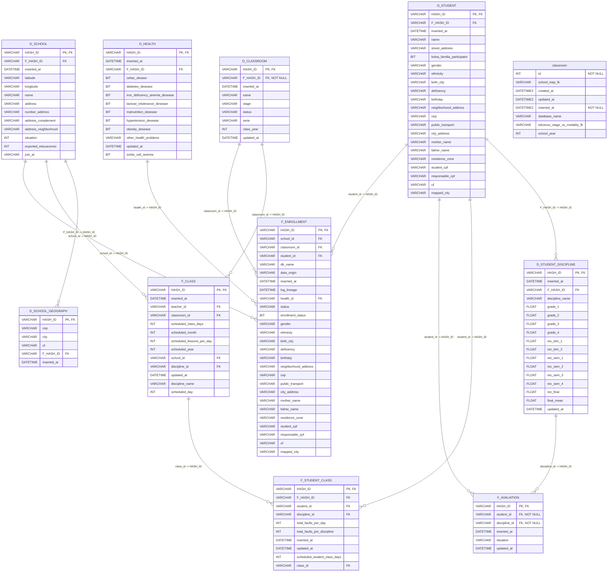

# Diagrama ER Completo (Todas as Colunas)

Este diagrama mostra todas as tabelas com TODAS as suas colunas e relacionamentos.

## Legenda

### Notação de Relacionamentos

* `||--o{` : Um para Muitos (One to Many)
* A tabela à esquerda é a **referenciada** (tabela pai)
* A tabela à direita é a que **referencia** (tabela filha com FK)

### Indicadores de Colunas

* **PK** : Primary Key (Chave Primária)
* **FK** : Foreign Key (Chave Estrangeira)  
* **NOT NULL** : Campo obrigatório

## Estatísticas

* **Total de Tabelas**: 11
  * Dimensões: 6
  * Fatos: 4
  * Outras: 1
* **Total de Relacionamentos**: 12

### Tabelas Dimensão

* **D_CLASSROOM** (9 colunas)
* **D_HEALTH** (13 colunas)
* **D_SCHOOL** (13 colunas)
* **D_SCHOOL_GEOGRAPH** (6 colunas)
* **D_STUDENT** (22 colunas)
* **D_STUDENT_DISCIPLINE** (17 colunas)

### Tabelas Fato

* **F_AVALIATION** (6 colunas)
* **F_CLASS** (13 colunas)
* **F_ENROLLMENT** (27 colunas)
* **F_STUDENT_CLASS** (10 colunas)

## Tabela de Relacionamentos

| Tabela Origem (FK) | Coluna FK | Tabela Destino (PK) | Coluna PK |
|-------------------|-----------|---------------------|----------|
| D_SCHOOL_GEOGRAPH | `F_HASH_ID` | D_SCHOOL | `HASH_ID` |
| D_STUDENT_DISCIPLINE | `F_HASH_ID` | D_STUDENT | `HASH_ID` |
| F_AVALIATION | `student_id` | D_STUDENT | `HASH_ID` |
| F_AVALIATION | `discipline_id` | D_STUDENT_DISCIPLINE | `HASH_ID` |
| F_CLASS | `classroom_id` | D_CLASSROOM | `HASH_ID` |
| F_CLASS | `school_id` | D_SCHOOL | `HASH_ID` |
| F_ENROLLMENT | `classroom_id` | D_CLASSROOM | `HASH_ID` |
| F_ENROLLMENT | `health_id` | D_HEALTH | `HASH_ID` |
| F_ENROLLMENT | `school_id` | D_SCHOOL | `HASH_ID` |
| F_ENROLLMENT | `student_id` | D_STUDENT | `HASH_ID` |
| F_STUDENT_CLASS | `student_id` | D_STUDENT | `HASH_ID` |
| F_STUDENT_CLASS | `class_id` | F_CLASS | `HASH_ID` |
