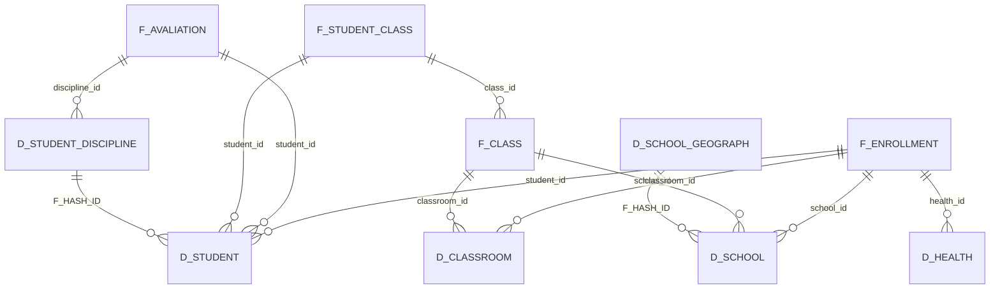

# Diagrama ER - Relacionamentos

```mermaid
erDiagram
    D_SCHOOL_GEOGRAPH ||--o{ D_SCHOOL : "F_HASH_ID"
    D_STUDENT_DISCIPLINE ||--o{ D_STUDENT : "F_HASH_ID"
    F_CLASS ||--o{ D_CLASSROOM : "classroom_id"
    F_CLASS ||--o{ D_SCHOOL : "school_id"
    F_STUDENT_CLASS ||--o{ D_STUDENT : "student_id"
    F_STUDENT_CLASS ||--o{ F_CLASS : "class_id"
    F_AVALIATION ||--o{ D_STUDENT : "student_id"
    F_AVALIATION ||--o{ D_STUDENT_DISCIPLINE : "discipline_id"
    F_ENROLLMENT ||--o{ D_SCHOOL : "school_id"
    F_ENROLLMENT ||--o{ D_CLASSROOM : "classroom_id"
    F_ENROLLMENT ||--o{ D_STUDENT : "student_id"
    F_ENROLLMENT ||--o{ D_HEALTH : "health_id"
```

**Legenda:** `||--o{` = Um para Muitos
