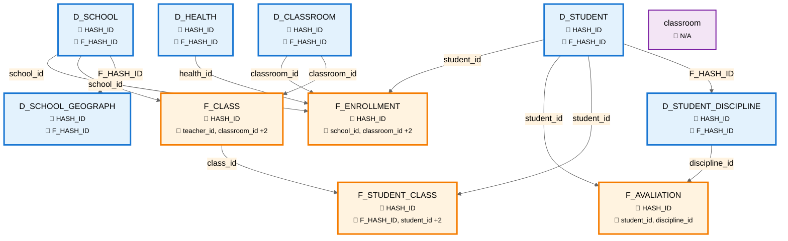

# Diagrama Visual de Schema (Estilo DBeaver)

Este diagrama mostra a estrutura completa do banco com todas as tabelas e suas relações PK/FK.



## Legenda

### Símbolos

* 🔑 = **Primary Key** (Chave Primária)
* 🔗 = **Foreign Keys** (Chaves Estrangeiras)
* → = Relacionamento (da tabela pai para filha)

### Cores

* 🔵 **Azul** - Tabelas Dimensão (D_*)
* 🟠 **Laranja** - Tabelas Fato (F_*)
* 🟣 **Roxo** - Outras Tabelas

### Como Ler

* As **setas** mostram a direção do relacionamento
* A tabela de onde **sai a seta** é a tabela **pai** (contém a PK referenciada)
* A tabela para onde **vai a seta** é a tabela **filha** (contém a FK)
* O **label da seta** mostra o nome da coluna FK

### Exemplo

```
D_STUDENT -->|student_id| F_ENROLLMENT
```

Significa: `F_ENROLLMENT.student_id` é FK que referencia `D_STUDENT.HASH_ID`

## Estrutura do Schema


### 📊 Dimensões (6)

* **D_CLASSROOM**
* **D_HEALTH**
* **D_SCHOOL**
* **D_SCHOOL_GEOGRAPH**
* **D_STUDENT**
* **D_STUDENT_DISCIPLINE**

### 📈 Fatos (4)

* **F_AVALIATION**
* **F_CLASS**
* **F_ENROLLMENT**
* **F_STUDENT_CLASS**

### 📋 Outras (1)

* **classroom**
